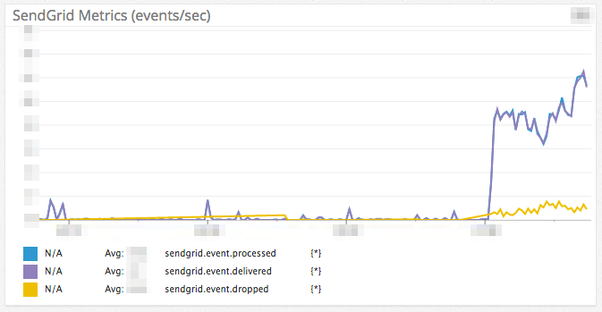

# SendGrid2Datadog

[](https://travis-ci.org/dtan4/sendgrid2datadog)
[](https://quay.io/repository/dtan4/sendgrid2datadog)

Send SendGrid metrics to Datadog



```
  +----------+
  |          |
  | SendGrid |
  |          |
  +----------+
      |
      | Event Notification
      |
+=====|===============================+
|     |    SendGrid2Datadog           |
|     v                               |
| +------------+        +-----------+ |           +---------+
| |            |        |           | |           |         |
| | API Server | -----> | DogStatsD |-----------> | DataDog |
| |            |        |           | |           |         |
| +------------+        +-----------+ |           +---------+
|                                     |
+=====================================+
```

## Install

### Heroku

[](https://heroku.com/deploy)

### Kubernetes

```bash
kubectl create -f kubernetes/namespace.yaml
kubectl create -f kubernetes/service.yaml

# Use envFrom (>= k8s 1.6)
kubectl create -f kubernetes/deployment-envFrom.yaml

# or else
kubectl create -f kubernetes/deployment.yaml
```

## Environment variables

|Kubernetes Secret name|Key|Description|Required|
|---|---|---|---|
|`sendgrid2datadog`|`BASIC_AUTH_USERNAME`|basic auth username||
|`sendgrid2datadog`|`BASIC_AUTH_PASSWORD`|basic auth password||
|`dd-agent`|`API_KEY`|Datadog API key|Required|

If both `BASIC_AUTH_USERNAME` and `BASIC_AUTH_PASSWORD` are provided, basic auth will be enabled.

## License

[](LICENSE)
